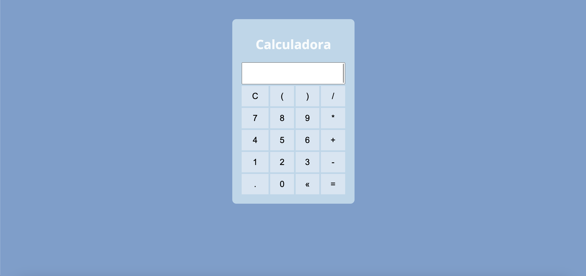

<h1 align="center"> CALCULADORA </h1>

Este é um projeto simples de uma calculadora para me ajudar na prática e no aprendizado da programação.
  link: https://renansm95.github.io/calculadora/

  <a href="#-tecnologias">Tecnologias</a>&nbsp;&nbsp;&nbsp;

  <a href="#-tecnologias">Informações</a>&nbsp;&nbsp;&nbsp;
 

## 🚀 Tecnologias

Esse projeto foi desenvolvido com as seguintes tecnologias:

- HTML
- CSS
- JavaScript
- Color Hunt
- Git e Github

---

## Informações

- Foi minha primeira calculadora, projeto desafiador no início, mas com a prática vai ficando mais tranquilo para desenvolver.

---

Feito por Renan Magalhães
